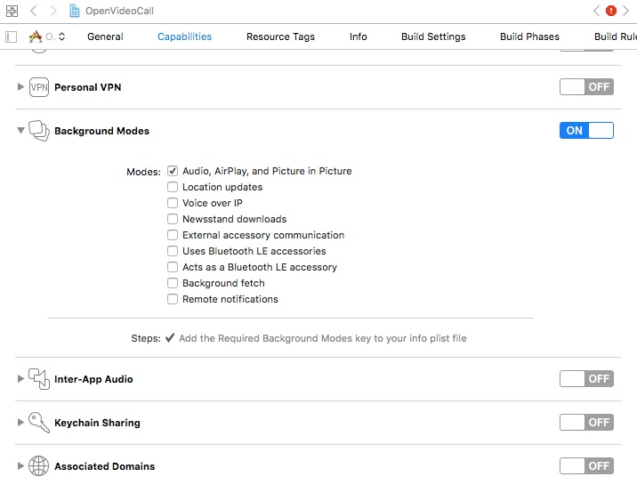
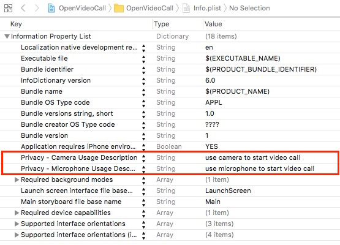
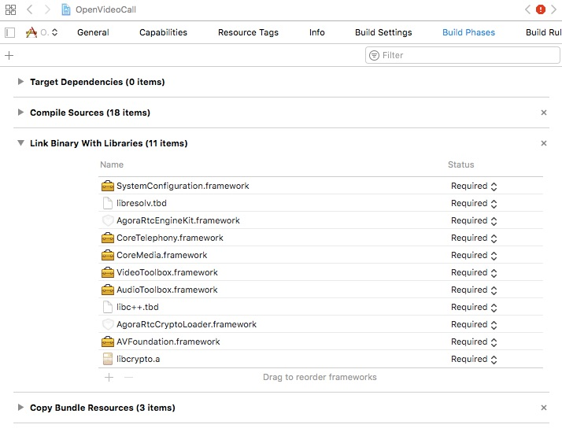
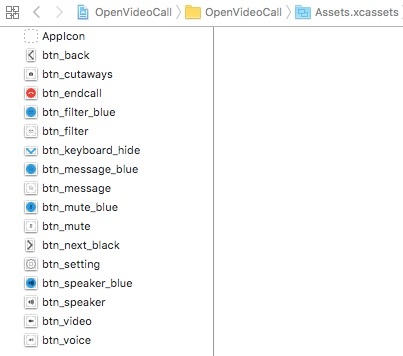
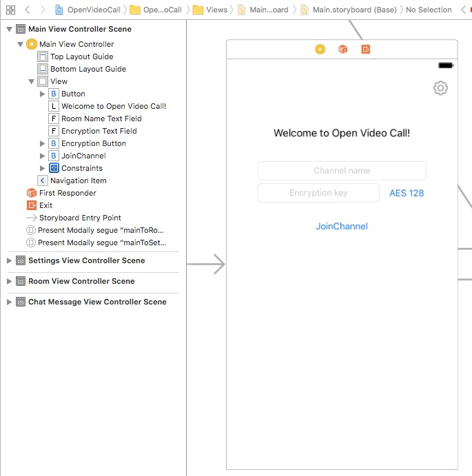
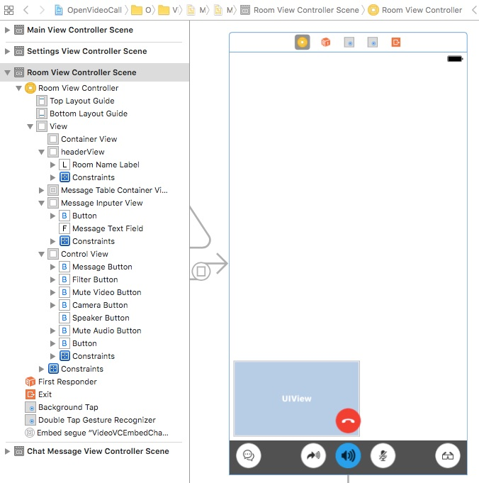
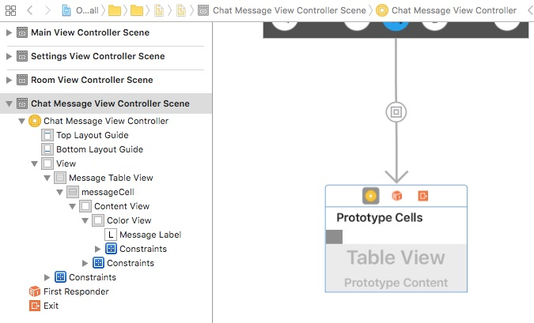
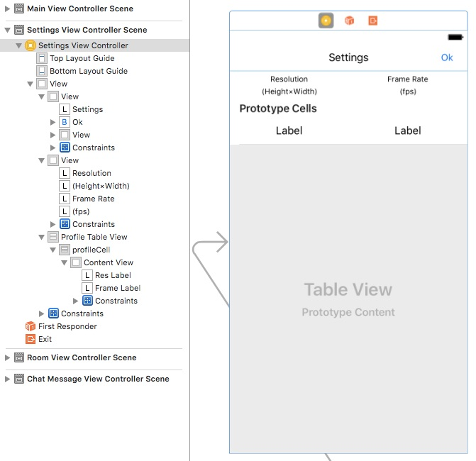

# Open Video Call iOS for Swift

This tutorial describes how to add video chat to your iOS applications using Swift and the Agora Video SDK.

With this sample app, you can:

- [Join/leave a channel](#create-dojoinpressed-ibaction-method)
- [Mute/unmute audio](#video-and-audio-methods)
- [Enable/disable video](#video-and-audio-methods)
- [Switch camera views](#camera-speaker-filter-and-close-methods)
- [Send a message to a channel](#create-send-method)
- [Set up the resolution, the frame rate, and the bit rate display](#create-the-remotevideostats-event-listener)
- [Enable encryption](#create-loadagorakit-method)
- [Enable/disable the black-and-white filter](#video-and-audio-methods)


## Prerequisites
- Xcode 8.0+
- Physical iOS device (iPhone or iPad)
	
	**Note:** Use a physical device to run the sample. Some simulators lack the functionality or the performance needed to run the sample.


## Quick Start

This section shows you how to prepare, build, and run the sample application.

- [Create an Account and Obtain an App ID](#create-an-account-and-obtain-an-app-id)
- [Integrate the Agora Video SDK](#integrate-the-agora-video-sdk)
- [Download and Build the Sample Application](#obtain-and-build-the-sample-application) 


### Create an Account and Obtain an App ID
To build and run the sample application, you must obtain an app ID: 

1. Create a developer account at [agora.io](https://dashboard.agora.io/signin/). Once you finish the sign-up process, you are redirected to the dashboard.
2. Navigate in the dashboard tree on the left to **Projects** > **Project List**.
3. Copy the app ID that you obtained from the dashboard into a text file. You will use this when you launch the app.


### Update and Run the Sample Application 

1. Open `OpenVideoCall.xcodeproj` and edit the `KeyCenter.swift` file. In the `agoraKit` declaration, update `<#Your App Id#>` with your app ID.

	``` Swift
    static let AppId: String = <#Your App Id#>
	```

2. Download the [Agora Video SDK](https://www.agora.io/en/download/). Unzip the downloaded SDK package and copy the following files from the SDK `libs` folder into the sample application `OpenVideoCall` folder.
	
	- `AograRtcEngineKit.framework`
	- `AgoraRtcCryptoLoader.framework`
	- `libcrypto.a`
		
3. Connect your iPhone or iPad device and run the project. Ensure a valid provisioning profile is applied or your project will not run.


## Steps to Create the Sample 

- [Set Permissions and Add Frameworks and Libraries](#set-permissions-and-add-frameworks-and-libraries)
- [Design the User Interface](#design-the-user-interface)
- [Create the MainViewController Class](#create-mainviewcontroller-class)
- [Create the MainViewController Class Delegates](#create-mainviewcontroller-class-delegates)
- [Create the RoomViewController Class](#create-roomviewcontroller-class)
- [Create RoomViewController Agora Methods and Delegates](#create-roomviewcontroller-agora-methods-and-delegates)
- [Create the ChatMessageViewController Class](#create-chatmessageviewcontroller-class)
- [Create the SettingsViewController Class](#create-settingsviewcontroller-class)

### Set Permissions and Add Frameworks and Libraries

Under the **Capabilities** tab, enable **Audio, AirPlay, and Picture in Picture** mode.



Open the `info.plist` file. Enable the camera and microphone privacy settings for the application.



Under the **Build Phases** tab, add the following frameworks and libraries to your project:

- `SystemConfiguration.framework`
- `libresolv.tbd`
- `AgoraRtcEngineKit.framework`
- `CoreTelephony.framework`
- `CoreMedia.framework`
- `VideoToolbox.framework`
- `AudioToolbox.framework`
- `libc++.tbd`
- `AgoraRtcCryptoLoader.framework`
- `AVFoundation.framework`
- `libcrypto.a`




### Design the User Interface

- [Add Assets](#add-assets)
- [Create the MainViewController UI](#create-mainviewcontroller-ui)
- [Create the RoomViewController UI and the ChatMessageViewController UI](#create-roomviewcontroller-and-chatmessageviewcontroller-ui)
- [Create the SettingsViewController UI](#create-settingsviewcontroller-ui)

#### Add Assets

Add the following assets to `Assets.xcassets`.

**Note:** Use Xcode to import assets to `Assets.xcassets`. PDF files are used for these assets, which contain images for each iOS screen resolution.



|Asset|Description                                                                                        |
|------|------|
|`btn_back` and `btn_next_black`|Image of a left and right arrow for navigation|
|`btn_cutaways`|An image of a camera and rotational arrows to switch between the two cameras|
|`btn_endcall`|An image of a red telephone for the *hang up* button|
|`btn_filter` and `btn_filter_blue`|Images of glasses for filtering|
|`btn_keyboard_hide`|An image of a down arrow used to hide/show the visual keyboard|
|`btn_message` and `btn_message_blue`|Images of chat bubbles to initiate a call|
|`btn_mute` and `btn_mute_blue`|Images of a microphone to mute/unmute audio|
|`btn_setting`|An image of a cog to open the settings window|
|`btn_speaker` and `btn_speaker_blue`|Images of speakers to turn audio on/off
|`btn_video`|An image of a camera to start video|
|`btn_voice`|An image of an arrow indicating that audio chat is enabled|

#### Create the MainViewController UI

Create the layout for the `MainViewController`.

**Note:** This layout includes navigation `segues` to move from screen to screen.



#### Create the RoomViewController UI and the ChatMessageViewController UI

Create the layout for the `RoomViewController` and `ChatMessageViewController`. The `ChatMessageViewController` view is embedded in the `RoomViewController` view.

**Note:** The `RoomViewController` layout includes tap and double-tap gesture recognizers for handling user interaction.





#### Create the SettingsViewController UI

Create the layout for the `SettingsViewController`.




### Create the MainViewController Class

*MainViewController.swift* defines and connects application functionality with the [MainViewController UI](#create-mainviewcontroller-ui).

- [Define Global Variables](#define-global-variables)
- [Override the prepare() Segue Method](#override-prepar-segue-method)
- [Create the doRoomNameTextFieldEditing() IBAction Method](#create-doroomnametextfieldediting-ibaction-method)
- [Create the doEncryptionTextFieldEditing() IBAction Method](#create-doencryptiontextfieldediting-ibaction-method)
- [Create the doEncryptionTypePressed() IBAction Method](#create-doencryptiontypepressed-ibaction-method)
- [Create the doJoinPressed() IBAction Method](#create-dojoinpressed()-ibaction-method)
- [Create the enter() Method](#create-enter-method)


#### Define Global Variables

The `MainViewController` class has three `IBOutlet` variables. These map to the [MainViewController UI](#create-mainviewcontroller-ui) elements.

Variable|Description
----|----
`roomNameTextField`|Maps to the **Channel name** `UITextField` in the `MainViewController` layout
`encryptionTextField`|Maps to the **Encryption key** `UITextField` in the `MainViewController` layout
`encryptionButton`|Maps to the **AES 128** `UIButton` in the `MainViewController` layout

``` Swift
import UIKit

class MainViewController: UIViewController {
    
    @IBOutlet weak var roomNameTextField: UITextField!
    @IBOutlet weak var encryptionTextField: UITextField!
    @IBOutlet weak var encryptionButton: UIButton!
    
    ...
}
```

The `MainViewController` class has two private variables.

The `videoProfile` variable is initialized with the default Agora video profile using `AgoraVideoProfile.defaultProfile()`.

The `encryptionType` is initialized to `EncryptionType.xts128`. When a new `encryptionType` is set, set the `encryptionButton` text to the new encryption type using `encryptionButton?.setTitle()`.

``` Swift    
    fileprivate var videoProfile = AgoraVideoProfile.defaultProfile()
    
    fileprivate var encryptionType = EncryptionType.xts128 {
        didSet {
            encryptionButton?.setTitle(encryptionType.description(), for: UIControlState())
        }
    }
```

#### Override the prepare Segue Method

Override the `prepare()` segue method to manage the application navigation. 

If the `segueId` is `mainToSettings`, prepare the settings view through the segue destination `SettingsViewController`:

- Set `settingsVC.videoProfile` to the current `videoProfile`.
- Set `settingsVC.delegate` to `self`.

If the `segueId` is `mainToRoom `, prepare the room view through the segue destination `RoomViewController`:

- Set `roomVC.roomName` to `sender`.
- Set `roomVC.encryptionSecret` to the text entered in the `encryptionTextField`.
- Set `roomVC.encryptionType ` to the current `encryptionType`.
- Set `roomVC.videoProfile ` to the current `videoProfile`.
- Set `roomVC.delegate` to `self`.

``` Swift    
    override func prepare(for segue: UIStoryboardSegue, sender: Any?) {
        guard let segueId = segue.identifier else {
            return
        }
        
        switch segueId {
        case "mainToSettings":
            let settingsVC = segue.destination as! SettingsViewController
            settingsVC.videoProfile = videoProfile
            settingsVC.delegate = self
        case "mainToRoom":
            let roomVC = segue.destination as! RoomViewController
            roomVC.roomName = (sender as! String)
            roomVC.encryptionSecret = encryptionTextField.text
            roomVC.encryptionType = encryptionType
            roomVC.videoProfile = videoProfile
            roomVC.delegate = self
        default:
            break
        }
    }
```

#### Create the doRoomNameTextFieldEditing IBAction Method

The `doRoomNameTextFieldEditing()` `IBAction` method is invoked by `roomNameTextField`. When the `UITextField` text is edited, format the text using `MediaCharacter.updateToLegalMediaString()`.

``` Swift    
    @IBAction func doRoomNameTextFieldEditing(_ sender: UITextField) {
        if let text = sender.text , !text.isEmpty {
            let legalString = MediaCharacter.updateToLegalMediaString(from: text)
            sender.text = legalString
        }
    }
```

#### Create the doEncryptionTextFieldEditing IBAction Method

The `doEncryptionTextFieldEditing()` `IBAction` method is invoked by `encryptionTextField`. When the `UITextField` text is edited, format the text  using `MediaCharacter.updateToLegalMediaString()`.


``` Swift    
    @IBAction func doEncryptionTextFieldEditing(_ sender: UITextField) {
        if let text = sender.text , !text.isEmpty {
            let legalString = MediaCharacter.updateToLegalMediaString(from: text)
            sender.text = legalString
        }
    }
```

#### Create the doEncryptionTypePressed IBAction Method

The `doEncryptionTypePressed()` `IBAction` method is invoked by `encryptionButton`. When the `UIButton` is pressed, create a popover UI object using `UIAlertController()`:

1. Create a `UIAlertAction` object for each encryption type and add it to `sheet`.

2. Create a `cancel` `UIAlertAction` object and add it to `sheet`.

3. Apply the popover above `encryptionButton` by setting `sheet.popoverPresentationController?.sourceView` and setting `sheet.popoverPresentationController?.permittedArrowDirections` to `.up`.

4. Display the pop using `present()`.


``` Swift    
    @IBAction func doEncryptionTypePressed(_ sender: UIButton) {
        let sheet = UIAlertController(title: nil, message: nil, preferredStyle: .actionSheet)
        
        for encryptionType in EncryptionType.allValue {
            let action = UIAlertAction(title: encryptionType.description(), style: .default) { [weak self] _ in
                self?.encryptionType = encryptionType
            }
            sheet.addAction(action)
        }
        
        let cancel = UIAlertAction(title: "Cancel", style: .cancel, handler: nil)
        sheet.addAction(cancel)
        sheet.popoverPresentationController?.sourceView = encryptionButton
        sheet.popoverPresentationController?.permittedArrowDirections = .up
        present(sheet, animated: true, completion: nil)
    }
```

#### Create the doJoinPressed IBAction Method

The **JoinChannel** UI Button in the `MainViewController` layout invokes the `doJoinPressed()` `IBAction` method. This method enters the user into the room specified by `roomNameTextField` using `enter()`.

``` Swift    
    @IBAction func doJoinPressed(_ sender: UIButton) {
        enter(roomName: roomNameTextField.text)
    }
```

#### Create the enter Method

The `enter()` method ensures the room name is valid before navigating to the room view using `performSegue()`.

``` Swift    
private extension MainViewController {
    func enter(roomName: String?) {
        guard let roomName = roomName , !roomName.isEmpty else {
            return
        }
        performSegue(withIdentifier: "mainToRoom", sender: roomName)
    }
}
```

### Create MainViewController Delegates

The `settingsVC` method is a delegate method for the `SettingsViewController`. This method is invoked when the video profile for the `SettingsViewController` changes. It updates the `videoProfile`, and dismisses the view using `dismiss()`.

``` Swift    
extension MainViewController: SettingsVCDelegate {
    func settingsVC(_ settingsVC: SettingsViewController, didSelectProfile profile: AgoraVideoProfile) {
        videoProfile = profile
        dismiss(animated: true, completion: nil)
    }
}
```

The `roomVCNeedClose` method is a delegate method for the `RoomVCDelegate`. This method is invoked when the user leaves the room, and dismisses the view using `dismiss()`.

``` Swift    
extension MainViewController: RoomVCDelegate {
    func roomVCNeedClose(_ roomVC: RoomViewController) {
        dismiss(animated: true, completion: nil)
    }
}
```

The `textFieldShouldReturn` method is a delegate method for the `UITextField` objects in `MainViewController`. This method is invoked when the user presses the keyboard return.

- If the current text field is `roomNameTextField`, enter the user into the specified room using `enter`.
- If the current text field is `encryptionTextField `, dismiss the keyboard using `textField.resignFirstResponder()`.

``` Swift    
extension MainViewController: UITextFieldDelegate {
    func textFieldShouldReturn(_ textField: UITextField) -> Bool {
        switch textField {
        case roomNameTextField:     enter(roomName: textField.text)
        case encryptionTextField:   textField.resignFirstResponder()
        default: break
        }
        
        return true
    }
}
``` 
 
### Create the RoomViewController Class

*RoomViewController.swift* defines and connects application functionality with the [RoomViewController UI](#create-roomviewcontroller-and-chatmessageviewcontroller-ui).

- [Define the RoomVCDelegate Protocol](#define-roomvcdelegate-protocol)
- [Define Global Variables](#define-global-variables)
- [Define IBOutlet Variables](#define-iboutlet-variables)
- [Define Private Class Variables](#define-private-class-variables)
- [Create Delegate and Superclass Methods](#create-delegate-and-superclass-methods)
- [Create IBAction Methods](#create-ibaction-methods)
- [Create Private Methods](#create-private-methods)

#### Define the RoomVCDelegate Protocol

The `roomVCNeedClose()` method is used for communication between the `RoomViewController` class and its delegate. The method informs the delegate  to close the room.

``` Swift
import UIKit

protocol RoomVCDelegate: class {
    func roomVCNeedClose(_ roomVC: RoomViewController)
}
```

#### Define Global Variables

The `RoomViewController` class has five public variables. These variables manage the `RoomViewController` settings.

Variable|Description
----|----
`roomName`|The name of the room
`encryptionSecret`|The encryption key for the room
`encryptionType`|The encryption type for the room
`videoProfile`|The video profile for the room
`delegate`|The delegate for the `RoomViewController` class
`AgoraRtcEngineKit`|The Agora RTC Engine SDK object

``` Swift    
    //MARK: public var
    var roomName: String!
    var encryptionSecret: String?
    var encryptionType: EncryptionType!
    var videoProfile: AgoraVideoProfile!
    weak var delegate: RoomVCDelegate?
    
    ...
    
    var agoraKit: AgoraRtcEngineKit!
    
    ...
```

#### Define IBOutlet Variables

The `RoomViewController` class has `IBOutlet` variables to manage buttons, view containers, and handle other UI elements. The variables map to the [RoomViewController UI](#create-roomviewcontroller-ui) elements.

Variable|Description
----|----
`containerView`|Container for the videos in the room
`flowViews`|Set of key UI elements that need to be visually managed by the controller
`roomNameLabel`|Label for the room name in the header of the layout
`controlView`|Container for the room control buttons
`messageTableContainerView`|List of messages
`messageButton`|Button for messaging
`muteVideoButton`|Button to mute/unmute the video
`muteAudioButton`|Button to mute/unmute the audio
`cameraButton`|Button for the camera
`speakerButton`|Button for the speakerphone
`filterButton`|Button for filtering
`messageInputerView`|Container for message creation
`messageInputerBottom`|Layout constraint for the message creation container
`messageTextField`|Text field for the message creation
`backgroundTap`|Single-tap gesture recognizer
`backgroundDoubleTap`|Double-tap gesture recognizer

``` Swift
class RoomViewController: UIViewController {
    
    //MARK: IBOutlet
    @IBOutlet weak var containerView: UIView!
    @IBOutlet var flowViews: [UIView]!
    @IBOutlet weak var roomNameLabel: UILabel!
    
    @IBOutlet weak var controlView: UIView!
    @IBOutlet weak var messageTableContainerView: UIView!
    
    @IBOutlet weak var messageButton: UIButton!
    
    @IBOutlet weak var muteVideoButton: UIButton!
    @IBOutlet weak var muteAudioButton: UIButton!
    
    @IBOutlet weak var cameraButton: UIButton!
    @IBOutlet weak var speakerButton: UIButton!
    
    @IBOutlet weak var filterButton: UIButton!
    
    @IBOutlet weak var messageInputerView: UIView!
    @IBOutlet weak var messageInputerBottom: NSLayoutConstraint!
    @IBOutlet weak var messageTextField: UITextField!
    
    @IBOutlet var backgroundTap: UITapGestureRecognizer!
    @IBOutlet var backgroundDoubleTap: UITapGestureRecognizer!
    
    ...
}    
```

#### Define Private Class Variables

- [UI Management Variables](#ui-management-variables)
- [Video Session Variables](#video-session-variables)
- [Audio and Video Control Variables](#audio-and-video-control-variables)
- [Chat Message Control Variables](#chat-message-control-variables)

##### UI Management Variables

The `shouldHideFlowViews` variable defaults to `false`. When this variable changes, the `flowViews` are hidden/not hidden.

The `videoViewLayouter` variable is initialized by default and handles the layout for the video views.

``` Swift    
    //MARK: hide & show
    fileprivate var shouldHideFlowViews = false {
        didSet {
            if let flowViews = flowViews {
                for view in flowViews {
                    view.isHidden = shouldHideFlowViews
                }
            }
        }
    }
    
    ... 
    
    fileprivate let videoViewLayouter = VideoViewLayouter()
    
    ...
    
    //MARK: alert
    fileprivate weak var currentAlert: UIAlertController?
    
    ...
    
```

##### Video Session Variables

The `videoSessions` and `doubleClickFullSession` variables handle the video sessions for the room.

When `videoSessions` is set, update the interface with the video sessions using `updateInterface()`.

When `doubleClickFullSession` is set, update the interface with the video sessions using `updateInterface()` if (1) the number of sessions is `3` or more, and (2) the interface has not already been updated (to avoid duplication).

The `dataChannelId` is set to `-1` by default and manages the room channel.

The `currentAlert` is not set by default and is available for use to display alerts to the user.

``` Swift
    //MARK: engine & session
    
    ...
    
    fileprivate var videoSessions = [VideoSession]() {
        didSet {
            updateInterface(with: self.videoSessions, targetSize: containerView.frame.size, animation: true)
        }
    }
    
    fileprivate var doubleClickFullSession: VideoSession? {
        didSet {
            if videoSessions.count >= 3 && doubleClickFullSession != oldValue {
                updateInterface(with: videoSessions, targetSize: containerView.frame.size, animation: true)
            }
        }
    }
    
    ...
    
    fileprivate var dataChannelId: Int = -1    
    
    ...
    
```

##### Audio and Video Control Variables

The `audioMuted` and `videoMuted` variables are set to `false` by default, and manage the audio and video streams, respectively.

When `audioMuted` is set, the `muteAudioButton` image is updated, and the audio stream is muted/unmuted using `agoraKit.muteLocalAudioStream()`.

When `videoMuted` is set:

- The `muteVideoButton` image is updated.
- The `cameraButton` and `speakerButton` are set to hidden/not hidden. 
- The video stream is stopped/started using `agoraKit.muteLocalVideoStream()` and `setVideoMuted()`.
- The video view of the current user is set to hidden/not hidden using `updateSelfViewVisiable()`.

``` Swift
    //MARK: mute
    fileprivate var audioMuted = false {
        didSet {
            muteAudioButton?.setImage(UIImage(named: audioMuted ? "btn_mute_blue" : "btn_mute"), for: UIControlState())
            agoraKit.muteLocalAudioStream(audioMuted)
        }
    }
    fileprivate var videoMuted = false {
        didSet {
            muteVideoButton?.setImage(UIImage(named: videoMuted ? "btn_video" : "btn_voice"), for: UIControlState())
            cameraButton?.isHidden = videoMuted
            speakerButton?.isHidden = !videoMuted
            
            agoraKit.muteLocalVideoStream(videoMuted)
            setVideoMuted(videoMuted, forUid: 0)
            
            updateSelfViewVisiable()
        }
    }
```

The `speakerEnabled` variable is set to `true` by default. When this variable is set, the `speakerButton` image is updated and the speakerphone is enabled/disabled using `agoraKit.setEnableSpeakerphone()`. 

``` Swift
    //MARK: speaker
    fileprivate var speakerEnabled = true {
        didSet {
            speakerButton?.setImage(UIImage(named: speakerEnabled ? "btn_speaker_blue" : "btn_speaker"), for: UIControlState())
            speakerButton?.setImage(UIImage(named: speakerEnabled ? "btn_speaker" : "btn_speaker_blue"), for: .highlighted)
            
            agoraKit.setEnableSpeakerphone(speakerEnabled)
        }
    }
```

The `isFiltering` variable is set to `false` by default. When this variable is set:

- The creation of `agoraKit` is verified.
- If filtering is enabled, set the video preprocessing using `AGVideoPreProcessing.registerVideoPreprocessing()` and update the `filterButton` with the blue image. 
- If filtering is not enabled, update the `filterButton` with the white image.

``` Swift
    //MARK: filter
    fileprivate var isFiltering = false {
        didSet {
            guard let agoraKit = agoraKit else {
                return
            }
            
            if isFiltering {
                AGVideoPreProcessing.registerVideoPreprocessing(agoraKit)
                filterButton?.setImage(UIImage(named: "btn_filter_blue"), for: UIControlState())
            } else {
                AGVideoPreProcessing.deregisterVideoPreprocessing(agoraKit)
                filterButton?.setImage(UIImage(named: "btn_filter"), for: UIControlState())
            }
        }
    }
```

##### Chat Message Control Variables

The `chatMessageVC` variable manages the chat message list.

The `isInputing` variable is set to `false` as the default. When this is set:

- the `messageTextField` is activated/deactivated using `becomeFirstResponder()`/`resignFirstResponder()`.
- the `messageInputerView` is hidden/unhidden.
- the`messageButton` image is updated using `messageButton?.setImage()`.

``` Swift
    //MARK: text message
    fileprivate var chatMessageVC: ChatMessageViewController?
    fileprivate var isInputing = false {
        didSet {
            if isInputing {
                messageTextField?.becomeFirstResponder()
            } else {
                messageTextField?.resignFirstResponder()
            }
            messageInputerView?.isHidden = !isInputing
            messageButton?.setImage(UIImage(named: isInputing ? "btn_message_blue" : "btn_message"), for: UIControlState())
        }
    }
```

Initialize `cryptoLoader` using `AgoraRtcCryptoLoader()`. This object manages Agora encryption.

``` Swift    
    //MARK: crypto loader
    private let cryptoLoader = AgoraRtcCryptoLoader()
```

#### Create Delegate and Superclass Methods

The `viewDidLoad()` method initializes the `RoomViewController`: 

1. Set the `roomNameLabel` text.
2. Set the `backgroundTap` gesture recognizer to fail on double-tap using `backgroundTap.require()`.
3. Add the keyboard event listener using `addKeyboardObserver()`.
4. Load the Agora RTC engine SDK using `loadAgoraKit()`.

``` Swift
    //MARK: - life cycle
    override func viewDidLoad() {
        super.viewDidLoad()
        
        roomNameLabel.text = "\(roomName!)"
        backgroundTap.require(toFail: backgroundDoubleTap)
        addKeyboardObserver()
        
        loadAgoraKit()
    }
```

The `prepare()` segue method manages the navigation for the `RoomViewController`. If the `segueId` is `VideoVCEmbedChatMessageVC`, set `chatMessageVC` to the `ChatMessageViewController`; otherwise do nothing.

``` Swift
    override func prepare(for segue: UIStoryboardSegue, sender: Any?) {
        guard let segueId = segue.identifier else {
            return
        }
        
        switch segueId {
        case "VideoVCEmbedChatMessageVC":
            chatMessageVC = segue.destination as? ChatMessageViewController
        default:
            break
        }
    }
```

The `viewWillTransition()` method sets the `size` for each `session` in the `videoSessions` array and updates the interface with the new sizes using `updateInterface()`.

``` Swift
//MARK: - rotation
extension RoomViewController {
    override func viewWillTransition(to size: CGSize, with coordinator: UIViewControllerTransitionCoordinator) {
        for session in videoSessions {
            if let sessionSize = session.size {
                session.size = sessionSize.fixedSize(with: size)
            }
        }
        updateInterface(with: videoSessions, targetSize: size, animation: true)
    }
}
```

Return `.all` for `supportedInterfaceOrientations` to allow the sample application to support the device in any orientation.

``` Swift    
    override var supportedInterfaceOrientations : UIInterfaceOrientationMask {
        return .all
    }
```

The `textFieldShouldReturn()` delegate method applies to all `UITextField` elements in the `RoomViewController` layout. This method is invoked when the keyboard return is pressed while editing the text fields.

If the text field is not empty, invoke the `send()` method, and clear the text in the text field.

``` Swift
//MARK: - textFiled
extension RoomViewController: UITextFieldDelegate {
    func textFieldShouldReturn(_ textField: UITextField) -> Bool {
        if let text = textField.text , !text.isEmpty {
            send(text: text)
            textField.text = nil
        }
        return true
    }
}
```

#### Create IBAction Methods

These `IBAction` methods map to the UI elements for the `RoomViewController`:

- [Message Methods](#message-methods)
- [Video and Audio Methods](#video-and-audio-methods)
- [Camera, Speaker, Filter, and Close Methods](#camera,-speaker,-filter,-and-close-methods)
- [Gesture Recognizer Methods](#gesture-recognizer-methods)


##### Message Methods

The `doMessagePressed()` method is invoked by the `messageButton` UI button and updates `isInputing`.

The `doCloseMessagePressed()` method is invoked by the the UI button with the chat bubble image and sets `isInputing` to `false`.
    
``` Swift
    //MARK: - user action
    @IBAction func doMessagePressed(_ sender: UIButton) {
        isInputing = !isInputing
    }
    
    @IBAction func doCloseMessagePressed(_ sender: UIButton) {
        isInputing = false
    }
```

##### Video and Audio Methods

The `doMuteVideoPressed()` method is invoked by the `muteVideoButton` UI button and updates `videoMuted`.

The `doMuteAudioPressed()` method is invoked by the `muteAudioButton` UI button and updates `audioMuted`.


``` Swift
    @IBAction func doMuteVideoPressed(_ sender: UIButton) {
        videoMuted = !videoMuted
    }
    
    @IBAction func doMuteAudioPressed(_ sender: UIButton) {
        audioMuted = !audioMuted
    }
```

##### Camera, Speaker, Filter, and Close Methods

The `doCameraPressed()` method is invoked by the `cameraButton` UI button action and switches the camera view using `agoraKit.switchCamera()`.

The `doSpeakerPressed()` method is invoked by the `speakerButton` UI button action and updates `speakerEnabled`.
    
The `doFilterPressed()` method is invoked by the `filterButton` UI button action and updates `isFiltering`.

The `doClosePressed()` method is invoked by the red hangup UI button action and invokes the `leaveChannel()` method.

``` Swift
    @IBAction func doCameraPressed(_ sender: UIButton) {
        agoraKit.switchCamera()
    }
    
    @IBAction func doSpeakerPressed(_ sender: UIButton) {
        speakerEnabled = !speakerEnabled
    }
    
    @IBAction func doFilterPressed(_ sender: UIButton) {
        isFiltering = !isFiltering
    }
    
    @IBAction func doClosePressed(_ sender: UIButton) {
        leaveChannel()
    }
```

##### Gesture Recognizer Methods

The `doBackTapped()` method is invoked by the `backgroundTap` gesture recognizer and updates `shouldHideFlowViews`.

The `doBackDoubleTapped()` method is invoked by the `backgroundDoubleTap` gesture recognizer.

- If `doubleClickFullSession` is `nil`, detect the video session index, and set `doubleClickFullSession` to the selected video session.
- If `doubleClickFullSession` already exists, set `doubleClickFullSession` to nil.

``` Swift
    @IBAction func doBackTapped(_ sender: UITapGestureRecognizer) {
        if !isInputing {
            shouldHideFlowViews = !shouldHideFlowViews
        }
    }
    
    @IBAction func doBackDoubleTapped(_ sender: UITapGestureRecognizer) {
        if doubleClickFullSession == nil {
            //将双击到的session全屏
            if let tappedIndex = videoViewLayouter.reponseViewIndex(of: sender.location(in: containerView)) {
                doubleClickFullSession = videoSessions[tappedIndex]
            }
        } else {
            doubleClickFullSession = nil
        }
    }
```

#### Create Private Methods

The private methods for the `RoomViewController` are created as functions in a private extension.

``` Swift
//MARK: - private
private extension RoomViewController {
	...
}
```
- [Create the addKeyboardObserver() Method](#create-the-addkeyboardobserver-method)
- [Create the updateInterface() Methods](#create-the-updateinterface-methods)
- [Create Session Methods](#create-session-methods)
- [Create the UI Control Methods](#create-the-ui-control-methods)

##### Create the addKeyboardObserver Method

They `addKeyboardObserver()` method adds event listeners for keyboard events.

The `UIKeyboardWillShow` event is triggered before the keyboard is displayed.

The `strongSelf`, `keyBoardBoundsValue`, and `durationValue` variables are set from the notifications `userInfo`. If `userInfo` does not contain the relevant values, the callback is ended with a `return`. These values are used to set the following local variables:

Variable|Description
---|---
`keyBoardBounds`|Keyboard dimensions
`duration`|Animation time
`deltaY`|Keyboard `height`. Used to measure the keyboard vertical animation distance.

To keep the message box above the keyboard:

- If the `duration` is greater than `0`, animate `strongSelf.messageInputerBottom` using the animation type `UIKeyboardAnimationCurveUserInfoKey` if available.

- If the `duration` is less than or equal to `0`, set `strongSelf.messageInputerBottom.constant` to `deltaY`.

``` Swift
    func addKeyboardObserver() {
        NotificationCenter.default.addObserver(forName: NSNotification.Name.UIKeyboardWillShow, object: nil, queue: nil) { [weak self] notify in
            guard let strongSelf = self, let userInfo = (notify as NSNotification).userInfo,
                let keyBoardBoundsValue = userInfo[UIKeyboardFrameEndUserInfoKey] as? NSValue,
                let durationValue = userInfo[UIKeyboardAnimationDurationUserInfoKey] as? NSNumber else {
                    return
            }
            
            let keyBoardBounds = keyBoardBoundsValue.cgRectValue
            let duration = durationValue.doubleValue
            let deltaY = keyBoardBounds.size.height
            
            if duration > 0 {
                var optionsInt: UInt = 0
                if let optionsValue = userInfo[UIKeyboardAnimationCurveUserInfoKey] as? NSNumber {
                    optionsInt = optionsValue.uintValue
                }
                let options = UIViewAnimationOptions(rawValue: optionsInt)
                
                UIView.animate(withDuration: duration, delay: 0, options: options, animations: {
                    strongSelf.messageInputerBottom.constant = deltaY
                    strongSelf.view?.layoutIfNeeded()
                    }, completion: nil)
                
            } else {
                strongSelf.messageInputerBottom.constant = deltaY
            }
        }
        
        ...
        
    }
```

The `UIKeyboardWillHide` keyboard event is triggered before the keyboard is hidden from the screen.

1. Set `userInfo` from the notification's `userInfo` and extract `durationValue`/`duration`.

2. Return the message box to the bottom of the screen:

- If the `duration` is greater than `0`, animate `strongSelf.messageInputerBottom` using the animation type `UIKeyboardAnimationCurveUserInfoKey` if available.

- If the `duration` is less than or equal to `0`, set `strongSelf.messageInputerBottom.constant` to `0`.


``` Swift            
        NotificationCenter.default.addObserver(forName: NSNotification.Name.UIKeyboardWillHide, object: nil, queue: nil) { [weak self] notify in
            guard let strongSelf = self else {
                return
            }
            
            let duration: Double
            if let userInfo = (notify as NSNotification).userInfo, let durationValue = userInfo[UIKeyboardAnimationDurationUserInfoKey] as? NSNumber {
                duration = durationValue.doubleValue
            } else {
                duration = 0
            }
            
            if duration > 0 {
                var optionsInt: UInt = 0
                if let userInfo = (notify as NSNotification).userInfo, let optionsValue = userInfo[UIKeyboardAnimationCurveUserInfoKey] as? NSNumber {
                    optionsInt = optionsValue.uintValue
                }
                let options = UIViewAnimationOptions(rawValue: optionsInt)
                
                UIView.animate(withDuration: duration, delay: 0, options: options, animations: {
                    strongSelf.messageInputerBottom.constant = 0
                    strongSelf.view?.layoutIfNeeded()
                    }, completion: nil)
                
            } else {
                strongSelf.messageInputerBottom.constant = 0
            }
        }
```

##### Create the updateInterface Methods

The `updateInterface()` methods handle layout updates for the video session.

- The `updateInterface()` method with `animation` checks if animation is used for the update, and animates the update within 0.3 seconds using `UIView.animate()`.

``` Swift
    func updateInterface(with sessions: [VideoSession], targetSize: CGSize, animation: Bool) {
        if animation {
            UIView.animate(withDuration: 0.3, delay: 0, options: .beginFromCurrentState, animations: {[weak self] () -> Void in
                self?.updateInterface(with: sessions, targetSize: targetSize)
                self?.view.layoutIfNeeded()
                }, completion: nil)
        } else {
            updateInterface(with: sessions, targetSize: targetSize)
        }
    }
```

- The `updateInterface()` method without animation sets the location for `videoViewLayouter` and video views.

Loop through `sessions` to retrieve each `hostingView` and append the view to `peerVideoViews`:

- Apply `peerVideoViews` to the video layout manager using `videoViewLayouter.videoViews`.
- Set the large video view to `doubleClickFullSession?.hostingView`.
- Set `containerView` as the containing view for the videos.
- Update the layout using `videoViewLayouter.layoutVideoViews()`.
- Invoke `updateSelfViewVisiable()`.

**Note:** The `backgroundDoubleTap` gesture recognizer is enabled only for `3` or more video sessions. This gesture recognizer enables the ability to change the layout.

``` Swift
    func updateInterface(with sessions: [VideoSession], targetSize: CGSize) {
        guard !sessions.isEmpty else {
            return
        }
        
        let selfSession = sessions.first!
        videoViewLayouter.selfView = selfSession.hostingView
        videoViewLayouter.selfSize = selfSession.size
        videoViewLayouter.targetSize = targetSize
        var peerVideoViews = [VideoView]()
        for i in 1..<sessions.count {
            peerVideoViews.append(sessions[i].hostingView)
        }
        videoViewLayouter.videoViews = peerVideoViews
        videoViewLayouter.fullView = doubleClickFullSession?.hostingView
        videoViewLayouter.containerView = containerView
        
        videoViewLayouter.layoutVideoViews()
        
        updateSelfViewVisiable()
        
        //Only three people or more can switch the layout
        if sessions.count >= 3 {
            backgroundDoubleTap.isEnabled = true
        } else {
            backgroundDoubleTap.isEnabled = false
            doubleClickFullSession = nil
        }
    }
```

##### Create Session Methods

The `setIdleTimerActive()` method updates the idle timer of the sample application to be either active or inactive.

``` Swift
    func setIdleTimerActive(_ active: Bool) {
        UIApplication.shared.isIdleTimerDisabled = !active
    }
```

The `fetchSession()` method returns the `VideoSession` for a specified user. Loop through `videoSessions` until the `session.uid` matches the `uid`.

``` Swift    
    func fetchSession(of uid: UInt) -> VideoSession? {
        for session in videoSessions {
            if session.uid == uid {
                return session
            }
        }
        
        return nil
    }
```

The `videoSession()` method returns the `VideoSession` for the user. The difference between this method and the `fetchSession()` method is that if no `fetchSession()` exists a new `VideoSession` object is created and appended to `videoSessions`.

``` Swift    
    func videoSession(of uid: UInt) -> VideoSession {
        if let fetchedSession = fetchSession(of: uid) {
            return fetchedSession
        } else {
            let newSession = VideoSession(uid: uid)
            videoSessions.append(newSession)
            return newSession
        }
    }
```

The `setVideoMuted()` method starts/stops the video for a specified user. The `VideoSession` is retrieved using `fetchSession()` to apply `muted` to the `isVideoMuted` property.

``` Swift    
    func setVideoMuted(_ muted: Bool, forUid uid: UInt) {
        fetchSession(of: uid)?.isVideoMuted = muted
    }
```

##### Create the UI Control Methods

The `updateSelfViewVisiable()` method sets the user view to hidden/not hidden. If the number of `videoSessions` is `2`, determine if the view is hidden using `videoMuted`.

``` Swift
    func updateSelfViewVisiable() {
        guard let selfView = videoSessions.first?.hostingView else {
            return
        }
        
        if videoSessions.count == 2 {
            selfView.isHidden = videoMuted
        } else {
            selfView.isHidden = false
        }
    }
```

The `alert()` method appends an alert message to the chat message box using `chatMessageVC?.append()`.

``` Swift
    func alert(string: String) {
        guard !string.isEmpty else {
            return
        }
        chatMessageVC?.append(alert: string)
    }
```

### Create Agora Methods and Delegates

The methods applying the Agora SDK are placed within a private extension for the `RoomViewController`.

``` Swift
//MARK: - engine
private extension RoomViewController {
	...
}
```

- [Create the loadAgoraKit() Method](#create-loadagorakit()-method)
- [Create the addLocalSession() Method](#create-addlocalsession()-method)
- [Create the leaveChannel() Method](#create-leavechannel()-method)
- [Create the send() Method](#create-send()-method)
- [Create the AgoraRtcEngineDelegate](#create-agorartcenginedelegate)


#### Create the loadAgoraKit Method

The `loadAgoraKit()` method initializes the Agora RTC engine using `AgoraRtcEngineKit.sharedEngine()`:

1. Set the channel profile to `.communication`, enable video, and set the `videoProfile`.

2. Invoke `addLocalSession()` and start the preview using `agoraKit.startPreview()`.

3. If `encryptionSecret` is not empty, set the encryption using `agoraKit.setEncryptionMode()` and `agoraKit.setEncryptionSecret()`.

4. Join the channel `roomName` using `agoraKit.joinChannel()`:

- If the `code` is equal to `0`, the channel join is successful. Disable the idle timer using `setIdleTimerActive`.
- If the channel join is not successful, display an error message alert using `self.alert()`.

5. Complete the method with `agoraKit.createDataStream()` to create a data stream for the joined channel.

``` Swift
    func loadAgoraKit() {
        agoraKit = AgoraRtcEngineKit.sharedEngine(withAppId: KeyCenter.AppId, delegate: self)
        agoraKit.setChannelProfile(.communication)
        agoraKit.enableVideo()
        agoraKit.setVideoProfile(videoProfile, swapWidthAndHeight: false)
        
        addLocalSession()
        agoraKit.startPreview()
        if let encryptionType = encryptionType, let encryptionSecret = encryptionSecret, !encryptionSecret.isEmpty {
            agoraKit.setEncryptionMode(encryptionType.modeString())
            agoraKit.setEncryptionSecret(encryptionSecret)
        }
        
        let code = agoraKit.joinChannel(byToken: nil, channelId: roomName, info: nil, uid: 0, joinSuccess: nil)
        
        if code == 0 {
            setIdleTimerActive(false)
        } else {
            DispatchQueue.main.async(execute: {
                self.alert(string: "Join channel failed: \(code)")
            })
        }
        
        agoraKit.createDataStream(&dataChannelId, reliable: true, ordered: true)
    }
```

#### Create the addLocalSession Method

The `addLocalSession()` method appends the local video session to `videoSessions` and sets up the local video view using `agoraKit.setupLocalVideo()`.

If `MediaInfo` is available for the `videoProfile`, set the media info property for the local session using `localSession.mediaInfo`.

``` Swift
    func addLocalSession() {
        let localSession = VideoSession.localSession()
        videoSessions.append(localSession)
        agoraKit.setupLocalVideo(localSession.canvas)
        
        if let mediaInfo = MediaInfo(videoProfile: videoProfile) {
            localSession.mediaInfo = mediaInfo
        }
    }
```

#### Create the leaveChannel Method

The `leaveChannel()` method enables the user to leave the video session.

1. Clear the local video and leave the channel by applying `nil` as the parameter for `agoraKit.setupLocalVideo()` and `agoraKit.leaveChannel()`.
2. Stop the video preview using `agoraKit.stopPreview()` and set `isFiltering` to `false`.
3. Loop through `videoSessions` and remove its `hostingView` from the superview using `removeFromSuperview()`. 
4. Clear the video sessions array using `videoSessions.removeAll()`.
5. Set the idle timer to active using `setIdleTimerActive()`.
6. Complete the method by invoking the room to close using `delegate?.roomVCNeedClose()`.

``` Swift
    func leaveChannel() {
        agoraKit.setupLocalVideo(nil)
        agoraKit.leaveChannel(nil)
        agoraKit.stopPreview()
        isFiltering = false
        
        for session in videoSessions {
            session.hostingView.removeFromSuperview()
        }
        videoSessions.removeAll()
        
        setIdleTimerActive(true)
        delegate?.roomVCNeedClose(self)
    }
```

#### Create the send Method

The `send()` method sends a new message to the stream using `agoraKit.sendStreamMessage()`.

Append the message to the chat message view using `chatMessageVC?.append()`.

``` Swift
    func send(text: String) {
        if dataChannelId > 0, let data = text.data(using: String.Encoding.utf8) {
            agoraKit.sendStreamMessage(dataChannelId, data: data)
            chatMessageVC?.append(chat: text, fromUid: 0)
        }
    }
```

#### Create the AgoraRtcEngineDelegate

The `AgoraRtcEngineDelegate` methods are added through an extension for the `RoomViewController`.

``` Swift
//MARK: - engine delegate
extension RoomViewController: AgoraRtcEngineDelegate {
    
    ...
    
}
```

- [Create the rtcEngine Connection Methods](#create-the-rtcengine-connection-methods)
- [Create the errorCode Event Listener](#create-the-errorcode-event-listener)
- [Create the firstRemoteVideoDecodedOfUid Event Listener](#create-the-firstremotevideodecodedofuid-event-listener)
- [Create the firstLocalVideoFrameWith Event Listener](#create-the-firstlocalvideoframewith-event-listener)
- [Create the didOfflineOfUid Event Listener](#create-the-didofflineofuid-event-listener)
- [Create the didVideoMuted Event Listener](#create-the-didvideomuted-event-listener)
- [Create the remoteVideoStats Event Listener](#create-the-remotevideostats-event-listener)
- [Create the receiveStreamMessageFromUid Event Listener](#create-the-receivestreammessagefromuid-event-listener)
- [Create the didOccurStreamMessageErrorFromUid Event Listener](#create-the-didoccurstreammessageerrorfromuid-event-listener)


##### Create the rtcEngine Connection Methods

The `rtcEngineConnectionDidInterrupted()` method displays an alert with the error message `Connection Interrupted`.

The `rtcEngineConnectionDidLost()` method displays an alert with the error message `Connection Lost`.

``` Swift
    func rtcEngineConnectionDidInterrupted(_ engine: AgoraRtcEngineKit) {
        alert(string: "Connection Interrupted")
    }
    
    func rtcEngineConnectionDidLost(_ engine: AgoraRtcEngineKit) {
        alert(string: "Connection Lost")
    }
```

##### Create the errorCode Event Listener

The `didOccurError` event listener is triggered when the Agora RTC engine generates an error. Use this for logging and debugging.

``` Swift
    func rtcEngine(_ engine: AgoraRtcEngineKit, didOccurError errorCode: AgoraErrorCode) {
        //
    }
```

##### Create the firstRemoteVideoDecodedOfUid Event Listener

The `firstRemoteVideoDecodedOfUid` event listener is triggered when the first remote video is decoded.

1. Retrieve the video session of the user using `videoSession()`.

2. Set the session dimensions using `userSession.size` and update the media info using `userSession.updateMediaInfo()`.

3. Complete the method by setting up the remote video using `agoraKit.setupRemoteVideo()`.

``` Swift
    func rtcEngine(_ engine: AgoraRtcEngineKit, firstRemoteVideoDecodedOfUid uid: UInt, size: CGSize, elapsed: Int) {
        let userSession = videoSession(of: uid)
        let sie = size.fixedSize(with: containerView.bounds.size)
        userSession.size = sie
        userSession.updateMediaInfo(resolution: size)
        agoraKit.setupRemoteVideo(userSession.canvas)
    }
```

##### Create the firstLocalVideoFrameWith Event Listener

The `firstLocalVideoFrameWith` event listener is triggered when the first local video frame has `elapsed`.

Set the dimensions of the video session using `selfSession.size` and update the video interface using `updateInterface()`.

``` Swift
    //first local video frame
    func rtcEngine(_ engine: AgoraRtcEngineKit, firstLocalVideoFrameWith size: CGSize, elapsed: Int) {
        if let selfSession = videoSessions.first {
            let fixedSize = size.fixedSize(with: containerView.bounds.size)
            selfSession.size = fixedSize
            updateInterface(with: videoSessions, targetSize: containerView.frame.size, animation: false)
        }
    }
```

##### Create the didOfflineOfUid Event Listener

The `didOfflineOfUid` is triggered when a user goes offline.

Loop through `videoSessions` to retrieve the video session of the offline user:

- If the video session is found, remove the session `hostingView` from the superview using `removeFromSuperview()`.
- If the offline user session is `doubleClickFullSession`, set `doubleClickFullSession` to `nil`. 

``` Swift
    //user offline
    func rtcEngine(_ engine: AgoraRtcEngineKit, didOfflineOfUid uid: UInt, reason: AgoraUserOfflineReason) {
        var indexToDelete: Int?
        for (index, session) in videoSessions.enumerated() {
            if session.uid == uid {
                indexToDelete = index
            }
        }
        
        if let indexToDelete = indexToDelete {
            let deletedSession = videoSessions.remove(at: indexToDelete)
            deletedSession.hostingView.removeFromSuperview()
            if let doubleClickFullSession = doubleClickFullSession , doubleClickFullSession == deletedSession {
                self.doubleClickFullSession = nil
            }
        }
    }
```

##### Create the didVideoMuted Event Listener

The `didVideoMuted` is triggered when a user turns off video.

Set the video to off using `setVideoMuted()`.

``` Swift
    //video muted
    func rtcEngine(_ engine: AgoraRtcEngineKit, didVideoMuted muted: Bool, byUid uid: UInt) {
        setVideoMuted(muted, forUid: uid)
    }
```

##### Create the remoteVideoStats Event Listener

The `remoteVideoStats` event is triggered when a metric changes for the Agora RTC engine.

Retrieve the video session for the user using `fetchSession()` and update the `resolution`, `height`, and `fps` using `session.updateMediaInfo()`.

``` Swift
    //remote stat
    func rtcEngine(_ engine: AgoraRtcEngineKit, remoteVideoStats stats: AgoraRtcRemoteVideoStats) {
        if let session = fetchSession(of: stats.uid) {
            session.updateMediaInfo(resolution: CGSize(width: CGFloat(stats.width), height: CGFloat(stats.height)), fps: Int(stats.receivedFrameRate))
        }
    }
```

##### Create the receiveStreamMessageFromUid Event Listener

The `receiveStreamMessageFromUid` is triggered when a message is received from a user.

The method checks that the message `string` is not empty before appending it to the chat message view using `chatMessageVC?.append()`.

``` Swift
    //data channel
    func rtcEngine(_ engine: AgoraRtcEngineKit, receiveStreamMessageFromUid uid: UInt, streamId: Int, data: Data) {
        guard let string = String(data: data, encoding: String.Encoding.utf8) , !string.isEmpty else {
            return
        }
        chatMessageVC?.append(chat: string, fromUid: Int64(uid))
    }
```

##### Create the didOccurStreamMessageErrorFromUid Event Listener

The `didOccurStreamMessageErrorFromUid` is triggered when a user message error occurs and then logs the error using `print()`.

``` Swift
    func rtcEngine(_ engine: AgoraRtcEngineKit, didOccurStreamMessageErrorFromUid uid: UInt, streamId: Int, error: Int, missed: Int, cached: Int) {
        print("Data channel error: \(error), missed: \(missed), cached: \(cached)\n")
    }
```

### Create the ChatMessageViewController
*ChatMessageViewController.swift* defines and connects application functionality with the [ChatMessageViewController UI](#create-chatmessageviewcontroller-ui).

- [Add Global Variables and Superclass Overrides](#add-global-variables-and-superclass-overrides)
- [Create append() Methods](#create-append()-methods)
- [Create the UITableViewDataSource Object](#create-uitableviewdatasource-object)

#### Add Global Variables and Superclass Overrides

The `ChatMessageViewController` defines the `IBOutlet` variable `messageTableView`, which maps to the table created in the [ChatMessageViewController UI](#create-chatmessageviewcontroller-ui).

1. Initialize the private variable `messageList` to manage the array of messages for the chat.

2. When the `viewDidLoad()` method is invoked, set the row height for the message table using `messageTableView.rowHeight` and set the `estimatedRowHeight` to `24`.

``` Swift
import UIKit

class ChatMessageViewController: UIViewController {
    
    @IBOutlet weak var messageTableView: UITableView!
    
    fileprivate var messageList = [Message]()
    
    override func viewDidLoad() {
        super.viewDidLoad()
        
        messageTableView.rowHeight = UITableViewAutomaticDimension
        messageTableView.estimatedRowHeight = 24
    }
    
    ...
    
}
```

#### Create append Methods

The `append()` methods are used to add messages and alerts to the message window.

- The `append()` method for a `chat` creates a new `Message` object of type `.chat` and invokes the `append()` method for the `message`.

- The `append()` method for an `alert ` creates a new `Message` object of type `.alert` and invokes the `append()` method for `message`.

``` Swift
    func append(chat text: String, fromUid uid: Int64) {
        let message = Message(text: text, type: .chat)
        append(message: message)
    }
    
    func append(alert text: String) {
        let message = Message(text: text, type: .alert)
        append(message: message)
    }
```

The `append()` method for a `message` is created in an extension for the `ChatMessageViewController`.

The `message` is added to the `messageList`.

When the `messageList` contains more than `20` messages, delete the first message in the array using `updateMessageTable()`.

``` Swift
private extension ChatMessageViewController {
    func append(message: Message) {
        messageList.append(message)
        
        var deleted: Message?
        if messageList.count > 20 {
            deleted = messageList.removeFirst()
        }
        
        updateMessageTable(with: deleted)
    }
    
    ...
    
}
```

The `updateMessageTable()` method is a helper method to handle messages for the chat view.

1. Check that the `messageTableView` exists. If it does not exist, stop the method using `return`.

2. Retrieve the `IndexPath` for the last message by using `messageList.count - 1`.

3. Invoke `tableView.beginUpdates()` and delete any necessary rows using `tableView.deleteRows()`.

4. Add the new message to the table using `tableView.insertRows()` and complete the table updates using `tableView.endUpdates()`.

5. Display the last message on the screen using `tableView.scrollToRow()`.

``` Swift
    func updateMessageTable(with deleted: Message?) {
        guard let tableView = messageTableView else {
            return
        }
        
        let insertIndexPath = IndexPath(row: messageList.count - 1, section: 0)
        
        tableView.beginUpdates()
        if deleted != nil {
            tableView.deleteRows(at: [IndexPath(row: 0, section: 0)], with: .none)
        }
        tableView.insertRows(at: [insertIndexPath], with: .none)
        tableView.endUpdates()
        
        tableView.scrollToRow(at: insertIndexPath, at: .bottom, animated: false)
    }
```

#### Create the UITableViewDataSource Object

The `tableView()` data source methods are defined in an extension to the `ChatMessageViewController`. 

1. Return a `messageList.count` as the number of rows in the table section.

``` Swift
extension ChatMessageViewController: UITableViewDataSource {
    func tableView(_ tableView: UITableView, numberOfRowsInSection section: Int) -> Int {
        return messageList.count
    }
    
    ...
    
}
```

2. Create the table cell using `tableView.dequeueReusableCell()`.

3. Set the cell `message` using `cell.set` and return the resulting cell.

``` Swift
    func tableView(_ tableView: UITableView, cellForRowAt indexPath: IndexPath) -> UITableViewCell {
        let cell = tableView.dequeueReusableCell(withIdentifier: "messageCell", for: indexPath) as! ChatMessageCell
        let message = messageList[(indexPath as NSIndexPath).row]
        cell.set(with: message)
        return cell
    }
```

### Create the SettingsViewController

*SettingsViewController.swift* defines and connects application functionality with the [SettingsViewController UI](#create-settingsviewcontroller-ui).

- [Create Variables, Protocols, and IBAction Methods](#create-variables,-protocols,-and-ibaction-methods)
- [Create Delegate and DataSource Methods](#create-delegate-and-datasource-methods)
- [Create Agora Methods](#create-agora-methods)

#### Create Variables, Protocols, and IBAction Methods

The `settingsVC()` protocol method is used by external classes to update the video profile.

``` Swift
import UIKit

protocol SettingsVCDelegate: NSObjectProtocol {
    func settingsVC(_ settingsVC: SettingsViewController, didSelectProfile profile: AgoraVideoProfile)
}
```

The `profileTableView` `IBOutlet` variable maps to the profile table created in the [SettingsViewController UI](#create-settingsviewcontroller-ui).

``` Swift
class SettingsViewController: UIViewController {
    
    @IBOutlet weak var profileTableView: UITableView!
    
    ...
    
}
```

When the `videoProfile` is set, `profileTableView?.reloadData()` is invoked to update the profile table information. 

``` Swift
    var videoProfile: AgoraVideoProfile! {
        didSet {
            profileTableView?.reloadData()
        }
    }
```

The `delegate` variable is an optional `SettingsVCDelegate` object.

The private `profiles` variable is an array of `AgoraVideoProfile` objects and is initialized with `AgoraVideoProfile.list()`.

``` Swift
    weak var delegate: SettingsVCDelegate?
    
    fileprivate let profiles: [AgoraVideoProfile] = AgoraVideoProfile.list()
```

The `doConfirmPressed()` `IBAction` method is invoked by the **OK** button in the UI layout. This method updates the video profile by invoking `delegate?.settingsVC()`.

``` Swift
    @IBAction func doConfirmPressed(_ sender: UIButton) {
        delegate?.settingsVC(self, didSelectProfile: videoProfile)
    }
```

#### Create Delegate and DataSource Methods

The `tableView()` data source methods are added in an extension to the `SettingsViewController`. 

1. Return the `profiles.count` as the number of rows in the table section.

``` Swift
extension SettingsViewController: UITableViewDataSource {
    func tableView(_ tableView: UITableView, numberOfRowsInSection section: Int) -> Int {
        return profiles.count
    }
    
    ...
    
}
```

2. Create the table cell using `tableView.dequeueReusableCell()`.

3. Set the cell's `selectedProfile` using `cell.update` and return the resulting cell.

``` Swift
    func tableView(_ tableView: UITableView, cellForRowAt indexPath: IndexPath) -> UITableViewCell {
        let cell = tableView.dequeueReusableCell(withIdentifier: "profileCell", for: indexPath) as! ProfileCell
        let selectedProfile = profiles[indexPath.row]
        cell.update(with: selectedProfile, isSelected: (selectedProfile == videoProfile))
        
        return cell
    }
```

The `tableView()` delegate method is added in an extension to the `SettingsViewController`. 

When a table row is selected, set `videoProfile` to the `selectedProfile`.

``` Swift
extension SettingsViewController: UITableViewDelegate {
    func tableView(_ tableView: UITableView, didSelectRowAt indexPath: IndexPath) {
        let selectedProfile = profiles[indexPath.row]
        videoProfile = selectedProfile
    }
}
```

#### Create Agora Methods

The `AgoraVideoProfile` extension adds a `list()` method, which returns an array of `AgoraVideoProfile` objects using `AgoraVideoProfile.validProfileList()`.

``` Swift
private extension AgoraVideoProfile {
    static func list() -> [AgoraVideoProfile] {
        return AgoraVideoProfile.validProfileList()
    }
}
```

## Resources
- Find full API documentation in the [Document Center](https://docs.agora.io/en/)
- [File bugs about this sample](https://github.com/AgoraIO/OpenVideoCall-iOS/issues)

## Learn More
- [1 to 1 Video Tutorial for iOS/Swift](https://github.com/AgoraIO/Agora-iOS-Tutorial-Swift-1to1)
- Agora Video SDK samples are also available for the following platforms:
	- OpenVideoCall for [iOS (Objective-C)](https://github.com/AgoraIO/OpenVideoCall-iOS-Objective-C)
	- OpenVideoCall for [Android](https://github.com/AgoraIO/OpenVideoCall-Android)
	- OpenVideoCall for [Windows](https://github.com/AgoraIO/OpenVideoCall-Windows)
	- OpenVideoCall for [MacOS](https://github.com/AgoraIO/OpenVideoCall-macOS)

## License
This software is licensed under the MIT License (MIT). [View the license](LICENSE.md).